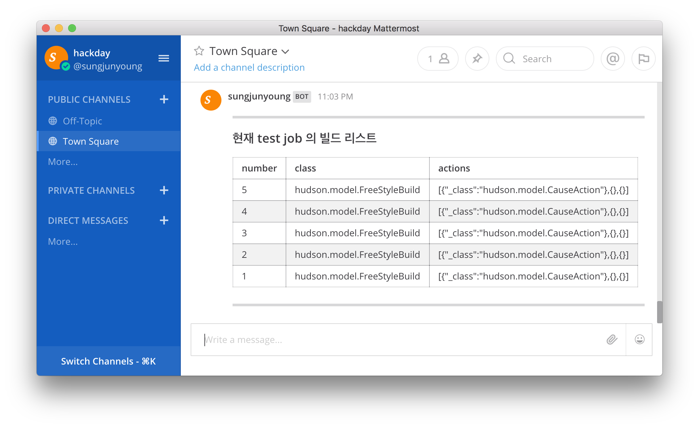

> **CAUTION** THIS PROJECT IS IN DEVELOPING
## mattermost - openwhisk - jenkins build chatbot

### Requirements
- python
- nodejs
- openwhisk cli
- mattermost
- jenkins

### Usage
> example exists already!
1. set environment variables
    1. JENKINS_USER
    2. JENKINS_TOKEN

1. create function
    ```
    python create.py --name build_list 
    ```
    > this command create folder with index.js and 
    create openwhisk function in IBM bluemix cloud functions
    
2. write code in `function/index.js`
3. write test code in `local-test.js`
4. test your code in local
    ```
    node local-test.js build_list
    ```
5. update your code to bluemix cloud functions
    ```
    python update.py --name build_list
    ```
6. set mattermost slash command
7. test your function


